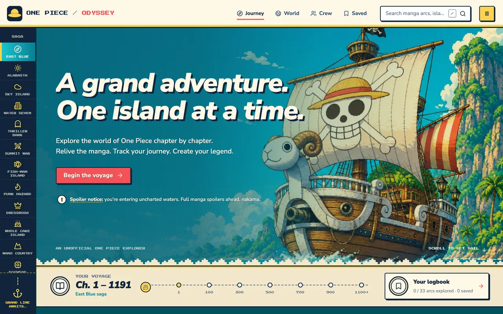
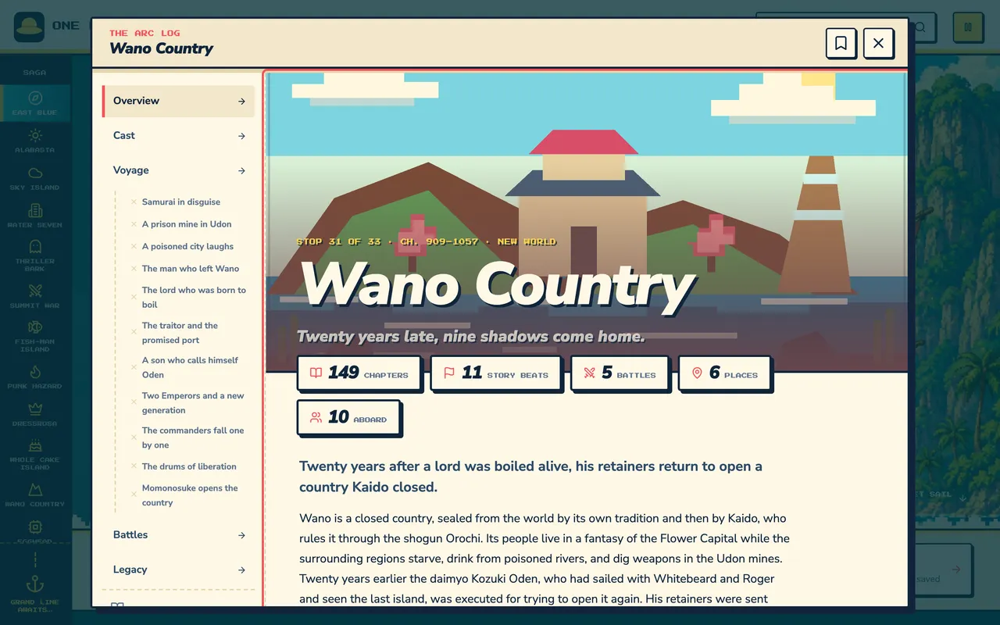
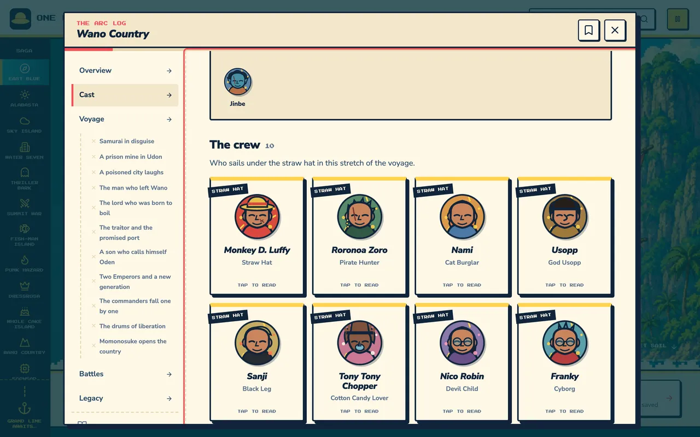
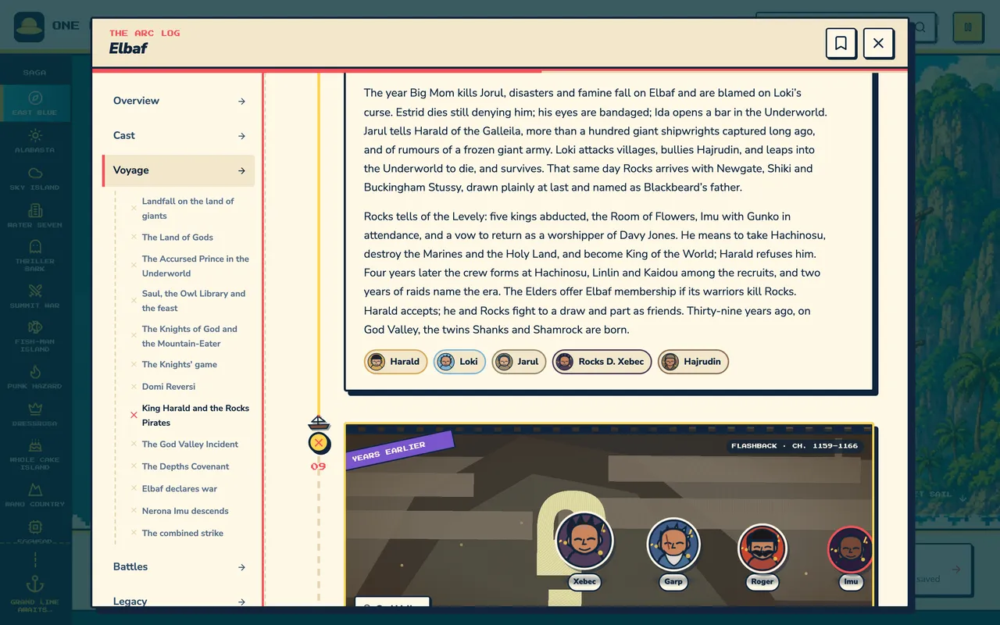
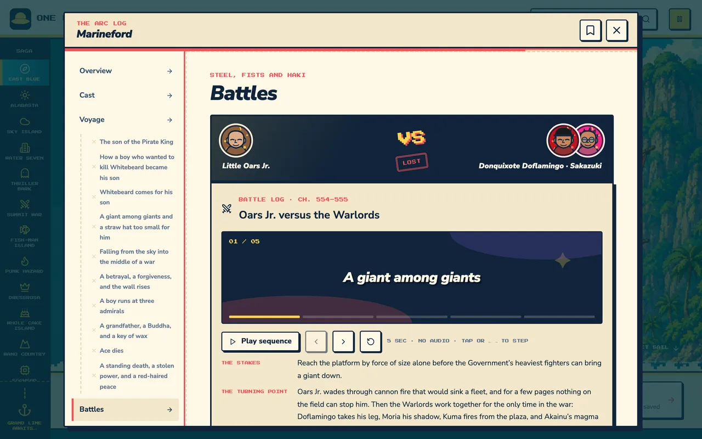
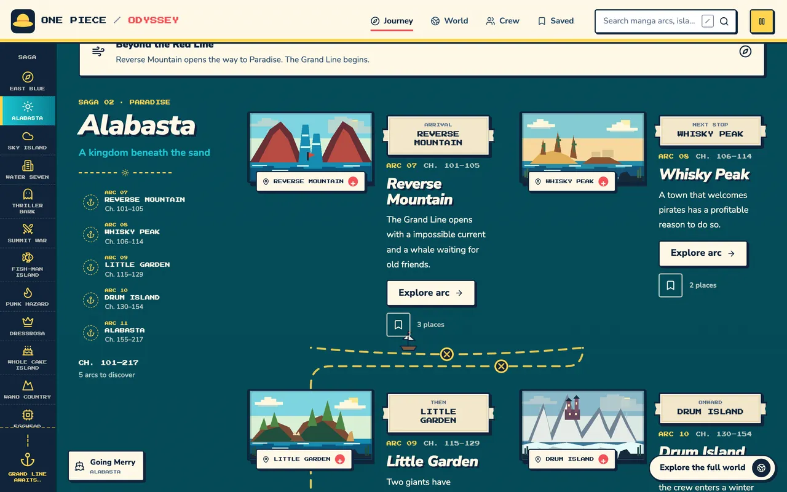
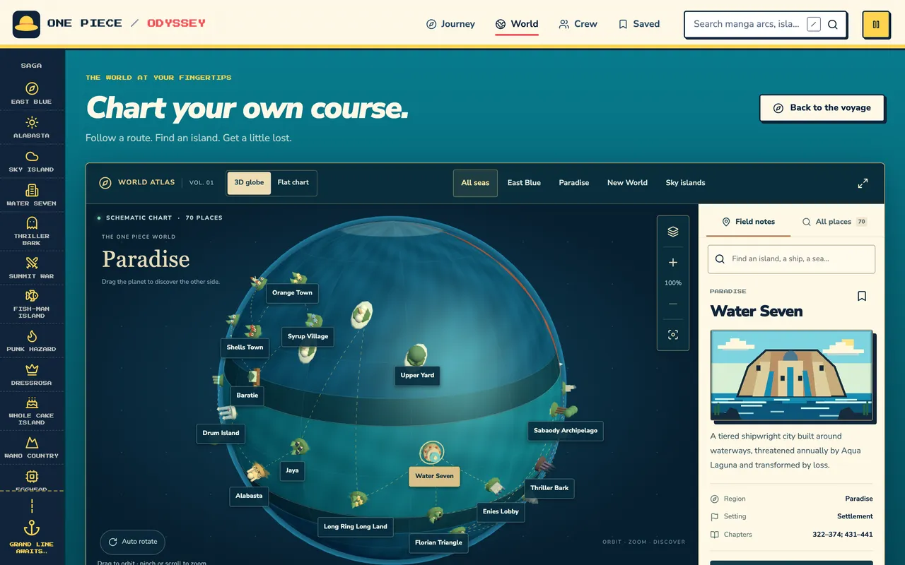

# One Piece Odyssey

**[one-piece-odyssey.netlify.app](https://one-piece-odyssey.netlify.app)**

An illustrated, animated fan explorer for the **One Piece** manga. Every arc from Romance Dawn to Elbaf is a stop on one continuous voyage: 33 arcs, 234 story beats, 93 battle logs and 70 places, narrated through chapter **1191**.

Everything you see is drawn in code. There are no manga panels, scans or translations anywhere in this repository.

> **Spoiler warning:** the whole site is full manga spoilers, with no gating.



## What it does

- **The journey.** One scrolling voyage down the Grand Line. Each saga is a panorama of islands two abreast, joined by a dashed gold route with a ship that sails to whichever arc you point at.
- **The arc reader.** Opening an arc opens an illustrated log, not a wall of text: a parallax title card, the crew aboard at that point in the story, the cast grouped by side on flip cards, the voyage as a route you draw by scrolling, versus battle cards, and bounty stamps.
- **Beat dioramas.** Every story beat is staged: its own location, a per-beat camera, a mood (dawn, day, dusk, night, storm, flashback) and the characters present standing in the frame. Flashbacks get sepia, grain and film sprockets.
- **World atlas.** A schematic chart of the world with a globe mode, layers, a voyage player and searchable field notes.
- **Crew and factions.** Wanted posters for the Straw Hats and a registry of the crews around them.
- **Your logbook.** Save arcs and places, mark arcs explored, resume where you stopped. It lives in your own browser and never leaves your device.
- **Motion you control.** Rich animation with the toggle on, and nothing but layout when it is off or when the system asks for reduced motion.

| | |
|---|---|
|  |  |
|  |  |
|  |  |

## Quick start

Requires Node 20.19 or newer.

```bash
npm ci
npm run dev        # http://localhost:5173
```

`npm run dev` regenerates the content index first, so a fresh clone works with no extra steps.

## Scripts

| Script | What it does |
|---|---|
| `npm run dev` | Vite dev server |
| `npm run build` | Type-check with project references, then build to `dist/` |
| `npm run preview` | Serve the built output |
| `npm run validate` | Referential integrity for all content: ids, chapter continuity, staging, coverage |
| `npm test` | Vitest unit tests |
| `npm run test:e2e` | Playwright tests on desktop Chrome and Pixel 7, including axe |
| `npm run typecheck` | `tsc -b` on its own |
| `npm run index` | Regenerate `src/data/index.generated.ts` |

## How it is put together

```
src/
  App.tsx              Journey page, saga rail, routing, logbook state
  state.ts             URL query routing and versioned localStorage
  styles.css           Design tokens and the whole journey page
  detail.css           The arc reader (ships in the lazy dialog chunk)
  components/
    arc/               The illustrated arc reader
      ArcDetail.tsx    Section assembly
      ArcHero.tsx      Parallax title card, count-up stats
      CastGallery.tsx  Crew deck and flip cards
      VoyageTimeline.tsx  Scroll-drawn route, one page per beat
      BeatScene.tsx    The beat diorama: camera, mood, figures
      BattleCard.tsx   Versus header and verdict stamp
      NextStop.tsx     Previous and next arc
    PixelScene.tsx     Every island, drawn as SVG pixel art
    CharacterPortrait.tsx  Animated portraits from a recipe per character
    WorldAtlas.tsx     Schematic chart, globe, voyage player
    DetailOverlay.tsx  The one dialog, lazy loaded
  data/                All content (see below)
scripts/
  validate.ts          Content integrity gate
  build-index.ts       Generates the light journey index
tests/                 Playwright specs
docs/                  Design ledger, specs, screenshots, concept art
```

Design intent lives in [DESIGN.md](DESIGN.md), behaviour in [UX-CONTRACT.md](UX-CONTRACT.md), the build ledger in [docs/IMPLEMENTATION.md](docs/IMPLEMENTATION.md), and current status in [docs/STATE.md](docs/STATE.md).

## The content model

Story text and stage directions are kept apart, so the reader can render portraits and scenes without parsing prose.

- **Prose** lives in `src/data/arcs-*.ts`, built with the `arc()`, `beat()` and `battle()` helpers. One file per era: East Blue, Alabasta, Paradise, Summit War, New World, Elbaf.
- **Staging** lives in `src/data/staging-*.ts`, one record per arc: a hook line, the cast with a side (`crew`, `ally`, `wildcard`, `foe`) and what each person wants in that arc, which location and mood each beat happens in, who is present, and who fights whom with a verdict.
- **Places** live in `src/data/locations*.ts`, each with landmarks, a schematic map position and an art brief.
- **Derived, never authored twice:** who is aboard during an arc comes from each Straw Hat's recruitment arc, and the bounties posted in an arc come from bounty history (`src/data/crew-roster.ts`).

`npm run validate` refuses to pass unless every arc has staging, every beat and battle is staged, every cast id resolves, chapters run continuously from 1 to the coverage cutoff, and every place an arc references exists.

## Art

No bitmaps ship with the story. Islands are SVG pixel scenes chosen per location in `PixelScene.tsx`, and character portraits are assembled from a small recipe language (hair, hat, scar, effect) in `CharacterPortrait.tsx`, with a deterministic fallback for anyone without a hand-written recipe. The only raster asset is the hero illustration.

## Accessibility and motion

Keyboard reachable throughout, with visible focus and 44px touch targets. The dialog manages focus and returns it to where you came from. Battle sequences step with the arrow keys and never autoplay with motion off. Playwright runs axe on the journey, atlas and notices; colour contrast is the one rule still excluded.

## Editorial status

Every summary here is original fan writing, marked `editorialStatus: 'draft'`. Arc and saga divisions are this project's navigation, not an official taxonomy, and chapter ranges are reading references rather than panel citations. Coverage facts, including the latest officially released chapter, live in `src/data/coverage.ts`. Known uncertainties are listed in [docs/STATE.md](docs/STATE.md).

## Rights and license

**ONE PIECE © Eiichiro Oda / Shueisha.** This is an independent, non-commercial fan project with no affiliation with, endorsement by, or connection to Eiichiro Oda, Shueisha, VIZ Media, Toei Animation, or any other rights holder. All names, characters, places and story events belong to their owners. Please read the manga through its official publishers.

The source code is released under the [MIT License](LICENSE). The original prose and illustrations in this repository describe a work that is not ours; do not present them as official One Piece material or resell them.

Rights holders who want something changed or removed: the contact address is on the site's notices page and in `src/data/legal.ts`, and requests are handled promptly.

## Deploying

Live at **[one-piece-odyssey.netlify.app](https://one-piece-odyssey.netlify.app)**, hosted on Netlify and configured by [`netlify.toml`](netlify.toml). Connect the repository and Netlify reads everything it needs: `npm run build`, publish `dist/`, Node 20.

The config also sets the pieces a static site still needs:

- Every path serves `index.html` with a 200, so deep links like `/?arc=wano&beat=onigashima` survive a cold load.
- A content security policy that allows only this origin. There are no third-party scripts, no analytics and no outbound requests, so nothing needs an exception beyond inline style attributes, which the animation library sets.
- Fingerprinted assets under `/assets` cached for a year.

For a one-off deploy from your machine:

```bash
npm run build
npx netlify deploy --prod --dir=dist
```

## Contributing

See [CONTRIBUTING.md](CONTRIBUTING.md). In short: run `npm run validate` after touching content, keep animation behind the motion toggle, and never add manga artwork.

## Keeping up with the manga

The story cutoff lives in `src/data/coverage.ts`. `npm run refresh:audit` reports how far behind the edition is and finds any place that repeats an edition fact and has drifted from it. The full procedure for pulling in newly released chapters — research, writing, art, verification — is the `chapter-refresh` skill in `.claude/skills/`.
